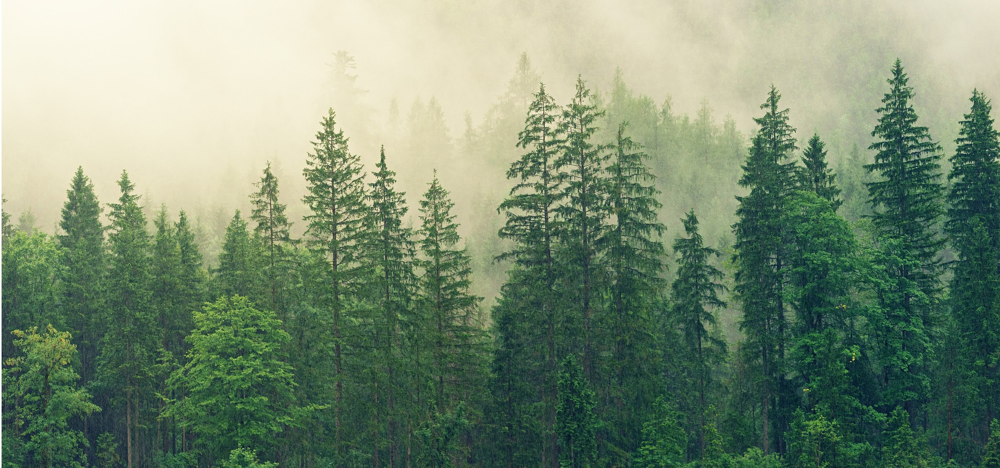

```{r setup, include=FALSE}
knitr::opts_chunk$set(echo = TRUE, comment = NA)
library(summarytools)


c1 ="#FF7F00"  # naranja - color primario 
c2 ="#034A94"  # azul oscuro - color secundario
c3 ="#0EB0C6"  # azul claro - color terciario
c4 ="#686868"  # gris - color texto
```

</br></br>

# <span style="color:#034a94">**Caso biomasa**</span> 

<center>

```{r, echo=FALSE, out.width="90%", fig.align = "center"}
 
```

Tomada de: pixabay.com

</center>

<br/><br/>

Uno de los propósitos a nivel mundial es el de estimar la captura de dióxido de carbono uno principales gases causantes del calentamiento global y por tanto del cambio climático. 

<br/>

Un gupo de investigadores están interesados en poder construir modelos que permitan la valoración de estos beneficio a traves de información recogida sobre caracteristicas de los árboles de una región, que les permita una estimación de la biomasa y así facilitar la toma de decciciones y la generación de políticas públicas.

<br/>

Se requiere ayude a los investigadores en su proposito utilizando la información contenida en la base de datos  arboles suministrada. 

<br/>

Proponga un **modelo de regresión lineal simple** que permita predecir el peso del árbol en función de las covariables que considere importantes y seleccionándolas de acuerdo con un proceso adecuado. 

<br/>

Tenga en cuenta realizar una evaluación de la significancia de los parámetros, validación de los supuesto e interpretación de los resultados. Proponga un método de evaluación por medio de validación cruzada. 

<br/><br/>

<pre>
install.packages("devtools") # solo la primera vez
devtools::install_github("dgonxalex80/paqueteMOD", force =TRUE)
library(paqueteMOD)
data(arboles)
</pre>

<br/><br/>

Realice un informe que permita cumplir con los requerimientos solicitados incluyendo conclusiones y recomendaciones. Adjunto los anexos los procesos realizados.


